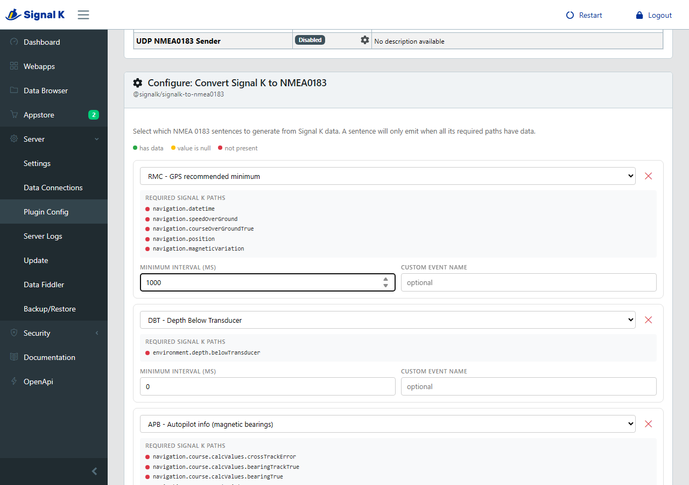

# signalk-to-nmea0183

[](https://github.com/SignalK/signalk-to-nmea0183/actions/workflows/ci.yml)
[](https://www.npmjs.com/package/@signalk/signalk-to-nmea0183)
[](https://github.com/SignalK/signalk-to-nmea0183/blob/master/LICENSE)

Signal K Node server plugin to convert Signal K data to NMEA 0183 sentences. Supports 42 sentence types including standard navigation (RMC, GGA, GLL, VTG), depth (DBT, DPT), wind (MWV, MWD, VWT), heading (HDG, HDM, HDT), and performance (PNKEP) sentences.

## Configuration

Open the Signal K admin UI, go to **Server > Plugin Config > Convert Signal K to NMEA0183**, and add the sentences you want to generate. Each row shows the required Signal K paths with live availability indicators (green = has data, red = missing), so you can see at a glance what's available.



Per conversion you can optionally set:

- **Minimum interval (ms)** to throttle high-frequency sentences
- **Custom event name** to route a sentence to a specific output (emitted in addition to the standard `nmea0183out` event)

## Output

Converted sentences are available on Signal K's built-in TCP NMEA 0183 server (port 10110). Connect with any TCP client (OpenCPN, kplex, Netcat, etc.) without further configuration.

### Serial output

To output sentences to a serial port, configure the serial connection in the admin UI and add `toStdout` to the provider in `settings.json`:

```
{
  "pipedProviders": [
    {
      "pipeElements": [
        {
          "type": "providers/simple",
          "options": {
            "logging": false,
            "type": "NMEA0183",
            "subOptions": {
              "validateChecksum": true,
              "type": "serial",
              "suppress0183event": true,
              "providerId": "a",
              "device": "/dev/ttyExample",
              "baudrate": 4800,
              "toStdout": "nmea0183out"          <------------ ADD THIS LINE
            },
            "providerId": "a"
          }
        }
      ],
      "id": "example",
      "enabled": true
    }
  ],
  "interfaces": {}
}
```

The `toStdout: "nmea0183out"` line routes the plugin's output to the serial port. If you configured a custom event name on a conversion, use that event name instead.

### Troubleshooting

If you cannot connect to the TCP NMEA 0183 server, verify it is enabled under **Server > Settings > Interfaces > nmea-tcp**.
